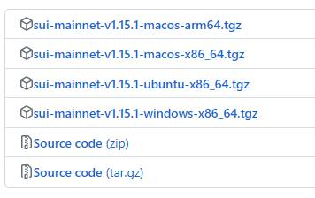
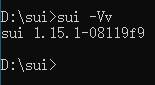
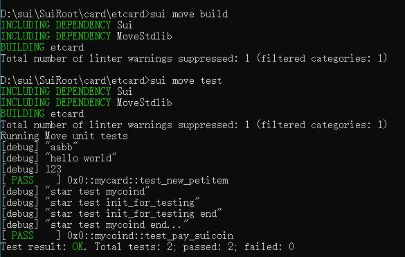
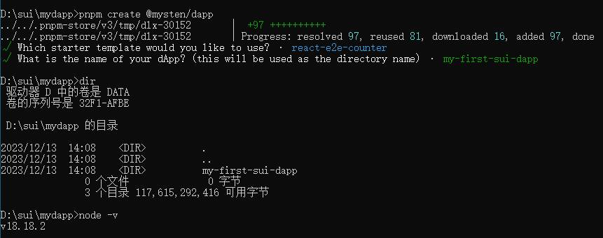

# suibombman 更新日常
https://github.com/summertoo/suibombman.git 

##一些有帮助的资料
[书籍]
https://intro-zh.sui-book.com
皮卡老师翻译的 Sui Move 导学 中文版 部署到这个域名了 ，大家可以方便学习了

[脚本]
一键安装sui.exe(Ellen老师)
因为用 windows 的同学比较多我写了个脚本可以一键下好 sui.exe 。无需安装 rust
Invoke-Expression (Invoke-WebRequest -Uri "https://gist.githubusercontent.com/WGB5445/73b3b54f8293125d4ba74260ea5a39ce/raw" -UseBasicParsing).Content    

简述我完成星航第二阶段的步骤(准备不是很充分...)
https://www.youtube.com/watch?v=iVlvx-On59w

##关于table和bag
可以把 table 想成 solidity 的 mapping（key&value 的 type 需要一致）但是 bag 不用
較常見的用法與例子是： table 紀錄特地資訊，例如特定地址的資訊 --> Table<address, u64>。
而 bag 可以是一個 object 需要儲存多種 token 時，為了減少 generic type 的輸入，把多種 token 同時放在一個 field 的 Bag type 底下，避免 type 的檢查
* by Jarek Lin

table的value是同类型数据
bag的value可以是不同类型数据
* by Clayon


## 听闻1.15.1版本上线主网(可喜可贺)
### Win版老用户快速5分钟升级到1.15.1
访问链接  
```
https://github.com/MystenLabs/sui/releases/tag/mainnet-v1.15.1
```
我是win用户所以下载文件,其他平台的各取所需  
sui-mainnet-v1.15.1-windows-x86_64.tgz  

解压压缩包,将文件sui-windows-x86_64.exe改名为sui.exe
移动入 C:\Users\Administrator\.cargo\bin
输入命令看一下当前版本  
  
下载源码 Source Code zip 并解压至工程同级目录  
修改toml 这里的../../../ 要根据实际情况调整
```
Sui = { local = "../../../sui/crates//sui-framework/packages/sui-framework"}
```
编译和测试通过  
  
愉快的编码吧


## 听闻create-dapp的win版本已经修复(可喜可贺)
[create-dapp] Fix path handling on windows #15319
https://github.com/MystenLabs/sui/pull/15319 
让我们来实际测试一下 运行  
``` 
pnpm create @mysten/dapp
```
看满离  


## 关于预付gas的相关讨论:

* 诺尔提出了 obelisk也有集成
等Henry分享一下

* alex提出了 ethos钱包有批量approve
相关资料在
https://docs.ethoswallet.xyz/hooks
wallet.requestPreapproval()

* uvd提出了 代付gas的赞助交易和zklogin 这两个概念
赞助交易
https://docs.sui.io/concepts/transactions/sponsored-transactions
zklogin相关(没细看)
https://docs.sui.io/concepts/cryptography/zklogin

## 制作了一个零知识证明相关的视频放在了抖音上
https://v.douyin.com/i8JgfJCA/

